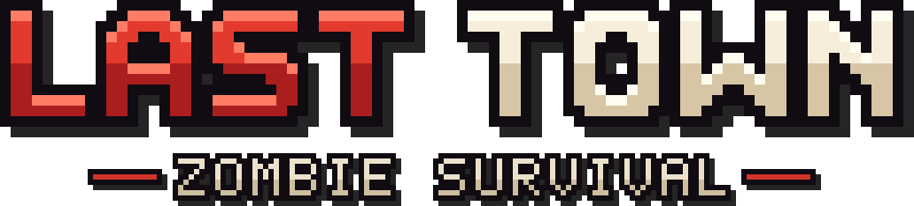
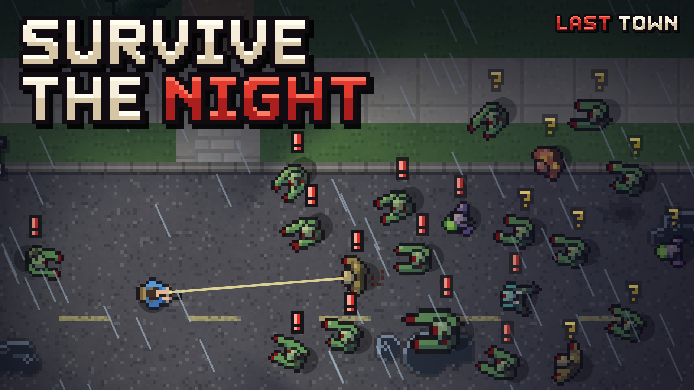

<p align="center">
  
</p>

# Last Town

**Last Town: Zombie Survival** é um jogo de sobrevivência zumbi co-op, 2D top-down, para Roblox: até 6 jogadores por
servidor, pixel art, escrito em **roblox-ts** e desenhado 100% em `ScreenGui`. Inspirado em Dead Town; o código, a
arte, os sons e os textos são nossos (`docs/DESIGN_RULES.md`, CON-01). Até 2026-09-24 o codinome era **Project Z**.

> The town fell in days. You're still standing. Survive the night.

De dia, saqueie os prédios, crafte armas e equipamento e fortifique uma casa antes do pôr do sol; de noite, segure a
horda com os amigos — cada tiro é barulho, e barulho atrai. Cada mundo é uma cidade nova gerada da semente do
servidor; quando todos caem, a cidade está perdida e outra nasce no dia 1.



## Rodar

```bash
npm ci
npm run build                                   # rbxtsc: src/ -> out/ (Luau)
rojo serve default.project.json --port 34872    # e o plugin do Rojo conectado no Studio
npm run watch                                   # recompila a cada mudança
```

A CI (`.github/workflows/ci.yml`) compila, roda as checagens e as suítes e publica o place do commit como o artefato
**place** (`LastTown-ci.rbxl`); na `main`, antes disso, o job `assets` sobe a arte e os sons novos (Open Cloud) e
commita os ids.

## Testar

```bash
npm run lint
npm run format:check
npm run validate:world    # as regras [auto] da bíblia de ambientação (docs/DESIGN_RULES.md)
npm run check:registers   # o limite de 200 locais por função do Luau
npm run check:luau        # o compilador oficial do Luau sobre out/
npm run check:place       # propriedades do place fixas no default.project.json
npm run test:<suíte>      # ex.: test:lobby, test:nav, test:save, test:assets-ci
```

As suítes rodam o TypeScript de verdade em Node, com shims de Luau; a lista de cada uma e o que ela cobre está no
`CLAUDE.md`.

## Arte, som e a página do jogo

```bash
npm run art:world   # a pixel art da cidade, os atlas e o nome do jogo -> design/world-art/ (a CI sobe)
npm run audio:sfx   # os nossos efeitos sonoros, sintetizados -> design/audio/ (ouvir: docs/audio/preview.html)
npm run promo       # a arte da página no Roblox, com o renderizador real -> docs/promo/
```

A página do jogo mora em [`docs/promo/`](docs/promo/): as cinco thumbnails, o ícone, os logos e como subir cada um
([`docs/promo/README.md`](docs/promo/README.md)), e o texto da página ([`docs/promo/DESCRIPTION.md`](docs/promo/DESCRIPTION.md)).

## Estrutura

| Pasta        | Conteúdo                                                                                                           |
| ------------ | ------------------------------------------------------------------------------------------------------------------ |
| `src/shared` | engine 2D (câmera, renderer, luz), mundo e gerador de cidade, simulação, dados (armas, craft, zumbis…), save, rede |
| `src/client` | bootstrap, loop, sistemas (combate, IA, construção…), a vista do mundo e a UI (kit de componentes e telas)         |
| `src/server` | o mundo autoritativo, save validado (DataStore), economia e loja, admin, analytics, matchmaking                    |
| `tools`      | geradores (arte, som, tema, locale, promo), checagens e as suítes de teste                                         |
| `design`     | tema, arte e sons gerados, a tabela de localização                                                                 |
| `docs`       | a bíblia de ambientação, multiplayer, analytics, Creator Hub, monetização, pesquisa e a arte da loja               |

## Documentação

- [`docs/DESIGN_RULES.md`](docs/DESIGN_RULES.md) — a bíblia de ambientação: toda decisão de produto, com as regras `[auto]` checadas por código.
- [`docs/MULTIPLAYER.md`](docs/MULTIPLAYER.md) — o servidor autoritativo, a rede, o save e os tipos de servidor.
- [`docs/CREATOR_HUB.md`](docs/CREATOR_HUB.md) — o que configurar no Creator Hub, o RTBF e a CI com Open Cloud.
- [`docs/ANALYTICS.md`](docs/ANALYTICS.md) e [`docs/MONETIZATION.md`](docs/MONETIZATION.md).

Os nomes de armazenamento continuam com o prefixo **ProjectZ** (DataStores, MemoryStore, RTBF) de propósito: trocá-los
apagaria o progresso dos jogadores. Veja `docs/CREATOR_HUB.md`, "Nomes de armazenamento".
